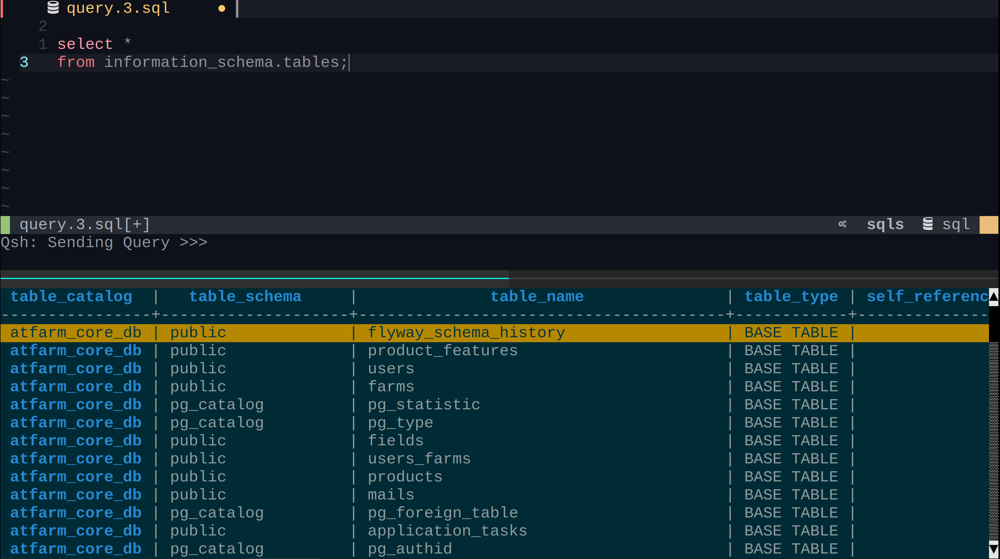

# qsh
Query SHell - improved querying from your terminal



Currently supports:
* `sqlite3`
* `mysql`
* `psql`
* `sqlcmd` (for `mssql`)
* `sqlcl` (for `oracle`)
* `mclient` (for `monetdb`)

There is also a generic mode, which can potentially be used with other tools not on this list. The generic mode can be used with non-database tools as well, like the `redis-cli`, REPLs and even shells, such as `bash`. See the [usage](https://github.com/muhmud/qsh/#generic-mode) section below for more details.

## Prerequisites

You'll need to install & use [tmux](https://github.com/tmux/tmux), which is needed to manage the split panes. It should be available from your package manager. Installing [jq](https://github.com/stedolan/jq) and `tree` would also be a good idea. For the generic mode, you will need `rlwrap` and `perl`.

For better viewing of SQL results, the [pspg](https://github.com/okbob/pspg) pager is recommended (ensure you have the latest version), however, you could also use `less -SinFX`. When displaying results, qsh will try to make a sensible choice, however, you can instead explicitly choose a pager.

To format SQL statements, you will need python 3 and [sqlparse](https://github.com/andialbrecht/sqlparse).

**Note: If you have issues, make sure your local install of `qsh` is fully [up-to-date](https://github.com/muhmud/qsh/#updating).**

## Setup

Clone this repository to your home:

```bash
$ git clone https://github.com/muhmud/qsh.git ~/.qsh
```

And then add the `~/.qsh/bin` directory to your `PATH`.

You now just need to setup the editor you want to use for writing SQL statements, which will be triggered from your SQL client tool. If you want to, and it's recommended, you can setup a keyboard shortcut for this in your tmux config. This will give you the same consistent shortcut for starting the editor from any tool.

The following example does this for `Alt-q`:

```
# qsh
bind-key -n M-q run-shell ~/.qsh/bin/qsh-start
```

You can currently use either `vim`/`nvim` or `micro`.

### vim/nvim

#### vim-plug

```
Plug 'muhmud/qsh', { 'dir': '~/.qsh', 'branch': 'main', 'rtp': 'editors/vim' }
```

#### packer

```
{ "~/.qsh/editors/vim", as = "Qsh" }
```

These are the default key mappings, which can be disabled by setting `g:qsh_enable_key_mappings` to `0`:

```
" Alt+e (for execute)
vnoremap <silent> <unique> <Esc>e :call QshExecuteSelection()<CR>
vnoremap <silent> <unique> <M-e> :call QshExecuteSelection()<CR>
vnoremap <silent> <unique> <F5> :call QshExecuteSelection()<CR>
inoremap <silent> <unique> <Esc>e <C-O>:call QshExecuteLine()<CR>
inoremap <silent> <unique> <M-e> <C-O>:call QshExecuteLine()<CR>
inoremap <silent> <unique> <F5> <C-O>:call QshExecuteLine()<CR>
nnoremap <silent> <unique> <Esc>e :call QshExecuteLine()<CR>
nnoremap <silent> <unique> <M-e> :call QshExecuteLine()<CR>
nnoremap <silent> <unique> <F5> :call QshExecuteLine()<CR>

" Alt+y
inoremap <silent> <unique> <Esc>y <C-O>:call QshExecuteAll()<CR>
inoremap <silent> <unique> <M-y> <C-O>:call QshExecuteAll()<CR>
nnoremap <silent> <unique> <Esc>y :call QshExecuteAll()<CR>
nnoremap <silent> <unique> <M-y> :call QshExecuteAll()<CR>

" Alt+g (for go)
inoremap <silent> <unique> <Esc>g <C-O>:call QshExecute()<CR>
inoremap <silent> <unique> <M-g> <C-O>:call QshExecute()<CR>
nnoremap <silent> <unique> <Esc>g :call QshExecute()<CR>
nnoremap <silent> <unique> <M-g> :call QshExecute()<CR>

" Alt+G
inoremap <silent> <unique> <Esc>G <C-O>:call QshExecute("^---$" 0)<CR>
inoremap <silent> <unique> <M-G> <C-O>:call QshExecute("^---$", 0)<CR>
nnoremap <silent> <unique> <Esc>G :call QshExecute("^---$", 0)<CR>
nnoremap <silent> <unique> <M-G> :call QshExecute("^---$", 0)<CR>

" Alt+d (for describe)
vnoremap <silent> <unique> <Esc>d :call QshExecuteNamedScriptVisually("describe")<CR>
vnoremap <silent> <unique> <M-d> :call QshExecuteNamedScriptVisually("describe")<CR>
nnoremap <silent> <unique> <Esc>d :call QshExecuteNamedScript("describe")<CR>
nnoremap <silent> <unique> <M-d> :call QshExecuteNamedScript("describe")<CR>
inoremap <silent> <unique> <Esc>d <C-O>:call QshExecuteNamedScript("describe")<CR>
inoremap <silent> <unique> <M-d> <C-O>:call QshExecuteNamedScript("describe")<CR>

" Alt+r (for rows)
vnoremap <silent> <unique> <Esc>r :call QshExecuteNamedScriptVisually("select-some")<CR>
vnoremap <silent> <unique> <M-r> :call QshExecuteNamedScriptVisually("select-some")<CR>
nnoremap <silent> <unique> <Esc>r :call QshExecuteNamedScript("select-some")<CR>
nnoremap <silent> <unique> <M-r> :call QshExecuteNamedScript("select-some")<CR>
inoremap <silent> <unique> <Esc>r <C-O>:call QshExecuteNamedScript("select-some")<CR>
inoremap <silent> <unique> <M-r> <C-O>:call QshExecuteNamedScript("select-some")<CR>

" Alt+t (for tidy)
vnoremap <silent> <unique> <Esc>t :call QshExecuteNamedSnippetVisually("format")<CR>
vnoremap <silent> <unique> <M-t> :call QshExecuteNamedSnippetVisually("format")<CR>

" Alt+v
vnoremap <silent> <unique> <Esc>v :call QshExecuteScriptVisually()<CR>
vnoremap <silent> <unique> <M-v> :call QshExecuteScriptVisually()<CR>
nnoremap <silent> <unique> <Esc>v :call QshExecuteScript()<CR>
nnoremap <silent> <unique> <M-v> :call QshExecuteScript()<CR>
inoremap <silent> <unique> <Esc>v <C-O>:call QshExecuteScript()<CR>
inoremap <silent> <unique> <M-v> <C-O>:call QshExecuteScript()<CR>

" Alt+Space
vnoremap <silent> <unique> <Esc><Space> :call QshExecuteSnippetVisually()<CR>
vnoremap <silent> <unique> <M-Space> :call QshExecuteSnippetVisually()<CR>
nnoremap <silent> <unique> <Esc><Space> :call QshExecuteSnippet()<CR>
nnoremap <silent> <unique> <M-Space> :call QshExecuteSnippet()<CR>
inoremap <silent> <unique> <Esc><Space> <C-O>:call QshExecuteSnippet()<CR>
inoremap <silent> <unique> <M-Space> <C-O>:call QshExecuteSnippet()<CR>


```

You can add custom key mappings like this:

```
autocmd Filetype sql call QshCustomSqlKeyMappings()
function QshCustomSqlKeyMappings() 
   ...
endfunction
```

### Micro

The [micro](https://micro-editor.github.io/) plugin can be installed by executing the following:

```bash
$ mkdir -p ~/.config/micro/plug && cp -r ~/.qsh/editors/micro ~/.config/micro/plug/qsh
```

The following key mappings, or similar, can be added to `~/.config/micro/bindings.json`:

```
"Alt-g": "command:QshExecute",
"Alt-G": "command:QshExecute '^---$' 0",
"Alt-e": "command:QshExecuteSelection",
"Alt-y": "command:QshExecuteAll",
"Alt-d": "command:QshExecuteNamedScript 'describe'",
"Alt-r": "command:QshExecuteNamedScript 'select-some'",
"Alt-v": "command:QshExecuteScript",
"Alt-i": "command:QshExecuteSnippet",
"Alt-t": "command:QshExecuteNamedSnippet 'format'"
```

## Usage

From within a `tmux` session, prefix the invocation of your SQL client with `qsh`:

```
$ qsh psql
```

This will setup your SQL client environment appropriately for `qsh`. Now, trigger the editor using the command for your environment. For `mysql`, this would be `\e;`, and for `psql`, `\e` or if you setup a keyboard shortcut in your tmux config, as described above, you could use that also. Alternatively, use the `-s` option to startup the editor automatically.

You should see the editor pane created, where you can now type in queries. A default SQL file is created for you, however, you could open up any other file you need to.

**Note: For `sqlcl`, you would start the editor by using `@qsh`**

### Generic Mode

If you invoke a tool that `qsh` does not know about, it will go into generic mode and will attempt to give you a usable querying experience, so you shouldn't need to do anything differently.

If your terminal looks messed up when the tool starts, try to use the REPL mode by specifying the `-r` option:

```
$ qsh -r redis-cli
```

You can also use the `-f` option to change the extension of the file opened up in the editor. This can be useful to enable language/domain specific features for the tool you are using. Setting this value to something that isn't `sql` implicitly enables REPL mode:

```
$ qsh -f js node
```

You can use scripts and snippets with generic mode tools by setting the `QSH_SCRIPTS_PATH` and `QSH_SNIPPETS_PATH` environment variables. See the sections below for details on how these work.

You can register the settings you use for generic tools, including certain environment variables, just as you would register a connection for a database. This makes it easier to invoke the tool in the same way in the future. See the [registering connections](https://github.com/muhmud/qsh/#registering-connections) section for more details, or just run the `qsh` and/or `qsh-reg` tools without any arguments.

For example, the following registers an invocation for using `qsh` with `zsh`:

```
$ QSH_EDITOR_COMMAND="\u001B\u0016" \
  QSH_NEWLINE_ON_COMMAND=1 \
  VISUAL=~/.qsh/scripts/qsh \
    qsh-reg -gisf sh zsh zsh
```

* `-g` - Grab environment variables, which will be restored when the tool is started
* `-i` - Invoke the tool as is, i.e. without `rlwrap`
* `-s` - Go straight into editor mode
* `-f sh` - Set the file extension for the default file opened up in the editor to `sh`
* `zsh` - The name of the invocation to create
* `zsh` - The actual invocation of zsh

Now this invocation of qsh can be started like this:

```
$ qsh zsh
```

### Executing Queries

* `Alt-e` - Highlight a query to run and execute it
* `Alt-g` - Execute a query without needing to highlight it
* `Alt-G` - Execute multiple statements or function/procedure definitions without needing to highlight
* `Alt-y` - Execute everything in the editor buffer

For `Alt-g`, `qsh` will look for a statement delimited on either side by a semi-colon. This makes it easier to execute a large SQL statement without needing to highlight it every time.

Alternatively, using `Alt-G` does the same thing but changes the delimiter to be the string `---`, which must be the only thing on a line. You can change this to what you like, this is simply the default as defined in the key mapping.

The following provides an example:

```sql
create procedure test(a int)
begin
  update test
    set a = 1;                  /* <- If the cursor is here, Alt-G will create procedure test only */
end;

---                             /* <- This is the customizable delimiter defined in the key binding */

create procedure test2(a int)
begin
  update test
    set a = 2;                  /* <- If the cursor is here, Alt-G will create procedure test2 only */
end;
```

### Scripts

* `Alt-v` - Execute a script, which can be done with or without highlighting

Scripts are shortcuts for SQL statements that return a consistent data set across different database servers. For example, to get a list of tables in the current database, whether `mysql` or `postgresql`, execute the following script:

```
tables
```

You can also apply additional filtering & sorting to scripts (you must highlight the query for this to work):

```
tables
where table_schema = 'public'
order by table_rows desc
```

There are quite a few scripts available. You can see what they are by executing the `scripts` script. You can also add you own custom scripts to `~/.qsh/clients/psql/scripts` or `~/.qsh/clients/mysql/scripts`, depending on the database platform you are targeting.

For reference, here is an example of the kinds of scripts available:

```
$ ls ~/.qsh/clients/psql/scripts
all-columns     all-references  all-sessions  columns    procedures  scripts      tables
all-databases   all-routines    all-tables    databases  references  select       triggers
all-functions   all-schemas     all-triggers  describe   routines    select-some  views
all-procedures  all-select      all-views     functions  schemas     sessions

```

You can keep your own scripts in separate directories and have `qsh` include them in its search by adding them to the `QSH_SCRIPTS_PATH` environment variable. 

#### Named Scripts

* `Alt-d` - Describe a particular table, which may or may not be highlighted
* `Alt-r` - Select some of the data for a particular table

Named scripts take information from the editor as a payload, which is used to provide context. The scripts mentioned above are created by default, however, you can also add your own.

You can either highlight the name of the table to be used with these scripts, however, it's also OK for the cursor to simply be on the table name.

### Snippets

* `Alt-Space` - Execute a snippet, which may or may not be highlighted

Snippets are similar to scripts, however, the results are injected into the editor instead of being displayed as query results. You can also add your own custom snippets to `~/.qsh/clients/psql/snippets` for `postgresql`, for example.

The snippets currently available are:

* General
   + `columns(<table-name>)` - Get a comma-separated list of column names for a particular table

* Scripting
   + `script-function(<function-name>)` - Script out a function
   + `script-procedure(<procedure-name>)` - Script out a procedure
   + `script-table(<table-name>)` - Script out a table
   + `script-trigger(<trigger-name>)` - Script out a trigger
   + `script-view(<view-name>)` - Script out a view

**Note: When scripting tables for `postgresql`, the invocation of `psql` must be passed to `pg_dump`. If the invocation involves typing in a password, you will be prompted to enter it. For this reason, it may be better to [register a connection](https://github.com/muhmud/qsh/#registering-connections).**

You can keep your own snippets in separate directories and have `qsh` include them in its search by adding them to the `QSH_SNIPPETS_PATH` environment variable.

#### Named Snippets

* `Alt-t` - Format a SQL statement, which must be highlighted

Similar to named scripts, these snippets take a payload from the editor. Currently, this feature can be used to format a SQL statement.

### Registering Connections

You can register connections for database servers that you access frequently. This can also be used to store the password for the connection using the native mechanism of each SQL client. This is achieved using the `qsh-reg` tool, and connection data will be stored under `~/.qsh/connections`.

For example:

```
$ qsh-reg -p dev-server psql -hmy-dev-server -Uroot -ddevdb
```

This will register a connection called `dev-server` using the provided `psql` invocation. The `-p` option means that a password is to be stored, which the script will prompt you for.

Once the connection is registered, you can connect like this:

```
$ qsh dev-server
```

Execute `qsh-reg` without any arguments to see all the available options.

#### Organising Connections

Connections can also be organised into directories to any level of depth:

```
$ qsh-reg -p production/prod-db psql -h ...
$ qsh-reg -p test/accounting/test-db mysql -h ...
```

You would connect just as before:

```
$ qsh production/prod-db
```

#### Using Other Database Tools

You can also execute other tools using the connection info, such as `pg_dump`, using the `-c` option:

```
$ qsh -c pg_dump dev-server --table=public.some_table -s
```

## Options

The following environment variables can be changed if required:

* `QSH_EDITOR` - The editor you are going to be using, which defaults to `$VISUAL`
* `QSH_PAGER` - The pager you will be using, which by default will try `pspg`, `less`, and `cat` in that order.
* `QSH_SCRIPTS_PATH` - Additional directories, separated by `:`, to search for scripts in
* `QSH_SNIPPETS_PATH` - Additional directories, separated by `:`, to search for snippets in
* `QSH_STARTUP_MODE` - If set to `1`, will make the `-s` option the default, and always startup the editor automatically

## Using SSH

To work with database servers over SSH, you should install `qsh` on your remote host and start `tmux` in your SSH session. You won't, however, be able to get `qsh` to work when the editor is running locally and the SQL client is on a remote server, i.e. running within an SSH connection.

If possible, it might be easier to simply provide host and port connection details to the SQL client on your workstation and run everything locally.

## Updating

You can update your local copy like this:

```
$ git -C ~/.qsh pull --rebase
```

If you're using the `micro` editor, you will also need to update the editor plugin:

```
$ cp -r ~/.qsh/editors/micro/* ~/.config/micro/plug/qsh/.
```

## Exit

To clean up any temporary files & go back to normal, simply exit the editor. If you exit accidentally, just trigger the editor again, and it should go back to how it was.

You can also explicitly cleanup temporary files created by `qsh` by executing:

```
$ qsh-cleanup
```

